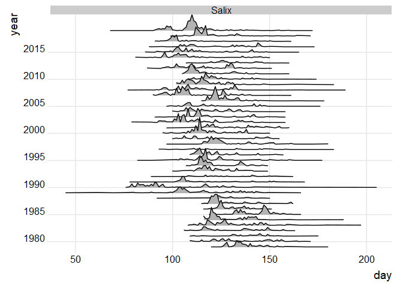
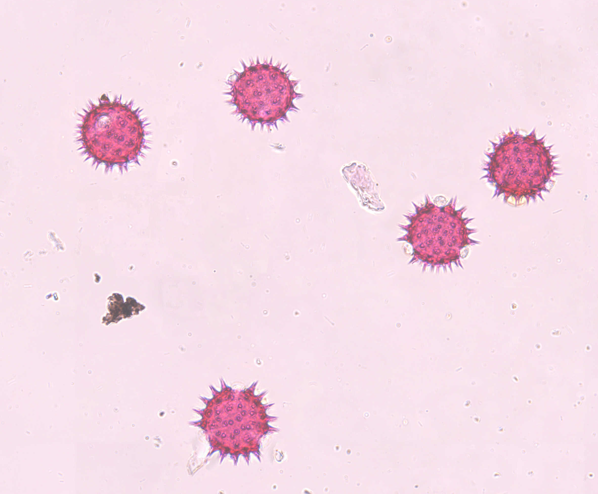

# Thesis topics in mathematical statistics

*Updated 2022-12-02.*

The department of Environmental Research and Monitoring at
the [Swedish Museum of Natural History](https://www.nrm.se/) (NRM) is responsible for
several monitoring programmes involving wildlife populations
and environmental contaminants. This generates large amounts
of data and many questions regarding their statistical analysis.

We offer a variety of thesis topics at both bachelor and 
master level intended for students at the Department of Mathematics, 
Stockholm University. Some suggestions are listed below (continuously updated). 
For each
project we have a suggested level (Bachelor/Master), but in
most cases they can be adapted to suit either.
If you are looking for a bachelor project that follows a 
standard template, this is probably not the place to look.
Our projects are based on questions we are sincerely
interested in, as such they tend to be unique and you 
should not be afraid to learn new statistical methods 
and approaches.

*Prerequisites:* You should be fluent in R, corresponding
to e.g. [Statistical Data Processing](https://sisu.it.su.se/search/archive_info/MT5013/en?archive=1),
in addition to the formal requirements for the thesis work.

*Contact:* If you are interested in a project or have questions, contact [Martin Sköld](https://www.nrm.se/ommuseet/kontakt/sokmedarbetare.10484.html?sv.url=12.6321786f122df65955f80007928&state=detail&userId=247.9ac8e13d01fc764c839e34686702ad37)

## Pollen monitoring

The department is responsible for the national [pollen forecast](https://pollenrapporten.se), working as an aid to people with allergies. 
As part of this work, pollen are on a daily basis caught on sticky tapes in traps and manually counted and classified by species in microscope.

### New (22-12-02): Pollen time-series analysis (a group of Bachelor students, but master level projects may also be considered)

During spring semester 2023 we hope to host a group of bachelor students investigating statistical aspects connected to our database of pollen counts. The database contains bi-hourly counts of a variety of pollen species at a number of stations. Topics could involve investigating meteorological factors (using open data from SMHI) influencing season onset or extent, connections to sales of antihistamines (using open data from Socialstyrelsen), next-day forecasting or diurnal patterns.

*Figure: Profiles of daily counts of Salix pollen from our database.*

### New (22-12-02): Classification of pollen images (Master)

Automatic detection and classification of pollen using machine learning has been an active field of research during the past decade. In this topic you will investigate methods of counting pollen by species on microscopic plate images. The process will essentially consist of first detecting and extracting objects from species reference sample images, training a (or several for comparison) machine learning algorithm to distinguish between species and evaluate the algorithm's performance on images containing a mixture of species. The algorithm may be compared both to manual counts (performed by museum staff) and an alternative approach based on DNA-sequencing.

Note that this project will necessarily involve some practical computational challenges related to e.g. feature extraction from images. 

*Figure: Part of microscopic image of Sunflower pollen reference sample.*

## Wildlife monitoring

The fluctuations of animal populations have fascinated 
mankind since prehistoric times. At NRM we are involved 
in the monitoring of threatened species like the baltic
harbour porpoise and the arctic fox, as well as species
who has recovered from immediate threat like the brown 
bear, seals and the golden and white-tailed eagles. Each species is 
monitored using its own method, e.g. acoustic detection 
(harbour porpoise), genetic identification of scat samples 
(brown bear) and aerial line transect sampling (ringed seal),
posing unique statistical challenges for the estimation
of abundance, trends and possibly harvest quotas.

### Project: Harbour seal abundance in Kalmar Sound (Master or ambitious bachelor)

The Kalmar Sound hosts a genetically unique population
of harbour seals. Seals are counted from the air three
times each year at several sites during moulting, when a relatively large
proportion of the individuals can be found ashore. It
is believed that more than half of the animals
are counted, but the exact proportion is uncertain, making
it difficult to make inference about the full size of 
the population.

A popular method for estimating abundance based on 
repeated partial counts are so called *N*-mixture
models ([Royle, 2004](https://doi.org/10.1111/j.0006-341X.2004.00142.x)). 
However, these models are often 
criticized for being very sensitive to model 
assumptions (e.g. [Barker et.al. (2018)](https://doi.org/10.1111/biom.12734), 
[Knape et.al. (2018)](https://doi.org/10.1111/2041-210X.13062)). 

This project involves implementing and adapting an
$N$-mixture model approach for harbour seal monitoring data, and
critically evaluate its usefulness for estimating abundance. Good
skills in working with data will be important for the project, knowledge
of Bayesian statistics and computation will be useful but not essential.

## Environmental contaminants 

An important factor behind the near-extinction of e.g. Baltic seals and white-tailed eagles in
the 70:ies was impaired reproduction due to the release of environmental contaminants
like mercury, DDT and PCBs. While many of these were banned for use in industry and
agriculture, they are resistant to environmental degradation and new toxins have
emerged since. The NRM are responsible for the national monitoring programmes of environmental
contaminants in biota. Within these programmes, concentrations of a wide array of toxins are
measured in (mainly) fish collected at various marine and freshwater locations. This generates
several thousands of time-series that are monitored for trends usng statistical methods.

### Project: Log-normal averages are not log-normal (Bachelor)

Variations in chemical concentrations are often modelled using a log-normal distribution. Hence, if 
we collect *n* fish samples and measure the concentration of a toxin in each, their log-concentrations are assumed to follow a normal distribution.

Sometimes, as a possibly more cost-effective way of measuring, concentrations are measured in
a mixture of *k* fish (essentially *k* fish put in a blender) rather than in individual fishes. The resulting concentration may then be interpreted as the arithmetic mean of the concentrations in the *k* individuals. But the arithmetic mean of *k* log-normally distributed
variables does not follow a log-normal distribution. The distribution does not even have a simple form (see [Dufresne (2008)](http://ozdaniel.com/A/DufresneLognormalsARC2008.pdf) for a review of the problem).

For some time-series in our monitoring programmes, practise has changed over time. The purpose
of this project is to evaluate the effect of such a change on estimates of trend. What bias can
we expect if we treat the mixture concentrations as log-normally distributed? Can we correct for this bias using some approximation of the distribution of sums of log-normals?

### Project: Using the LASSO for laboratory intercalibration (Bachelor)

In long-term monitoring programmes of contaminants it is important minimize the
effects of changes in sampling protocols and chemical analytical methods over 
time, to ensure they do not confound changes in contaminant concentrations. 

Recently, the NRM has been forced to consult a new laboratory for measurement
of some contaminants. To investigate possible systematic differences between the
old and the new lab, a number of samples have been analysed by both and correction
factors have been devised when results differ.

A common approach is to devise a correction when there is a statistically 
significant difference in measurements between laboratories. An alternative is
to use the LASSO, [LASSO](https://en.wikipedia.org/wiki/Lasso_(statistics)),
which simultaneously estimates coefficients and decides when to correct. This 
project will compare the two approaches, in particular how they perform
in relation to subsequent trend estimates.

## Other

### Project: Porpoise necropsy (Bachelor)

The harbour porpoise is the only endemic species of whale in the Baltic sea. Current estimates suggests that only a few hundred animals remain of the population.

When a dead porpoise is found stranded or mistakenly caught in fishing gear, it is sent for
necropsy at the National Veterinary Institute (usually assisted by people from NRM). Here, a
number of measurements (e.g. length and weight, as well as circumference and blubber thickness
at various sites) are taken in order to asses the health status of an individual. However,
carcasses are often in poor condition and may be partly eaten by other animals. The purpose of
this project is to find a model/method to predict e.g. the full weight of an animal, when some
parts are missing. This could be based on [principal components analysis](https://en.wikipedia.org/wiki/Principal_component_analysis), based on animals where all measurements are available.

# Old projects

These projects have already been used, but it may be possible to look at alternative approaches.

### Project: Individual heterogeneity in brown bear catchability (Bachelor/Master)

The Swedish brown bear population is monitored by volunteers collecting
scat samples that are sent for genetic identification to NRM ([description of programme](https://www.nrm.se/forskningochsamlingar/miljoforskningochovervakning/viltovervakning/brunbjorn/inventeringsarbete.9005859.html)). Under ideal
conditions, when samples can be assumed a random draw from the population,
the number of samples found from a particular individual will follow a
Poisson distribution. This can be utilized to estimate the proportion of
individuals for which no samples are found, and hence the size of the
whole population.

Unfortunately, conditions are not ideal and there is strong evidence of
individual heterogeneity in catchability. Some bears are more likely to
be sampled than others, and we need to find a model of how this varies
among individuals. [Link (2003)](https://doi.org/10.1111/j.0006-341X.2003.00129.x)
argues that popular models for heterogeneity are difficult to distinguish and may give
very different results. In this project you will perform a similar analysis
based on data from the Swedish monitoring programme and try to answer
whether the population size can be reliably estimated.

In a master thesis, more focus would lie on the spatial aspects of sample collection.

### Project: Bears across borders (Bachelor) 

The brown bear monitoring programme ([description of programme](https://www.nrm.se/forskningochsamlingar/miljoforskningochovervakning/viltovervakning/brunbjorn/inventeringsarbete.9005859.html)) is based on a rotating scheme, where one out of four
regions are surveyed in a particular year (in the fifth year there is no survey). Since
hunting quotas are set at the regional level, it is important to be able to estimate the
number of animals in each region. However,  bears
often have large home-ranges intersecting several regions, and a single animal may
contribute to the population estimate of more than one region.

This project will evaluate the bias in population estimates introduced by animals
counted more than once. It will use the locations of scat samples to estimate the extent 
animal home-ranges, e.g. by fitting bivariate normal distributions, and the proportions they
intersect with surveyed regions. 

